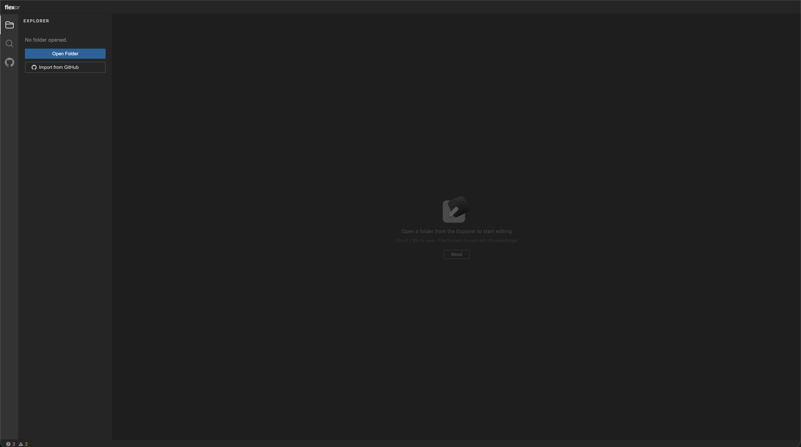
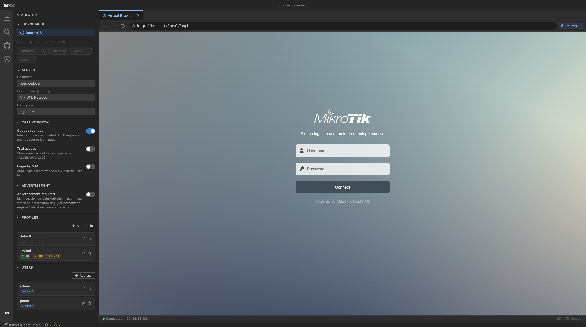
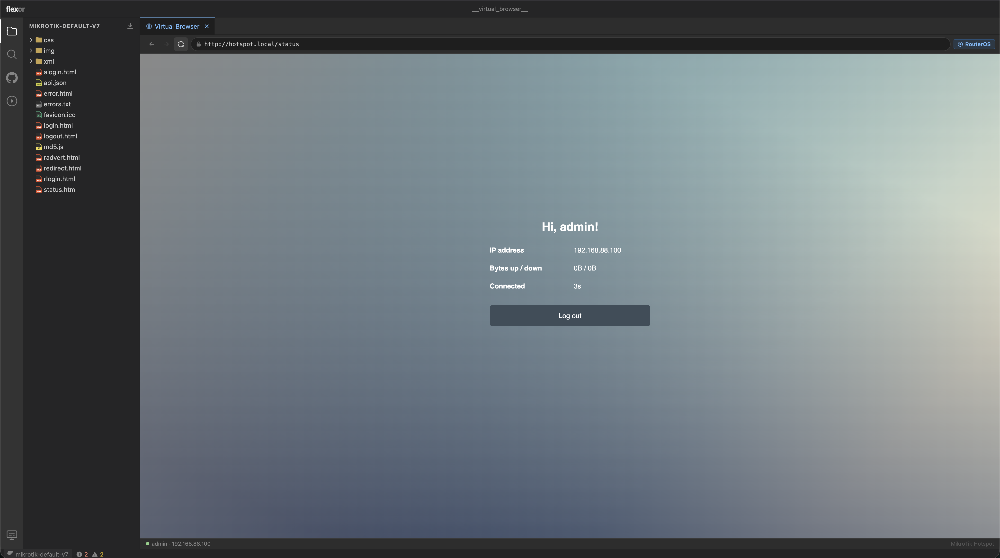
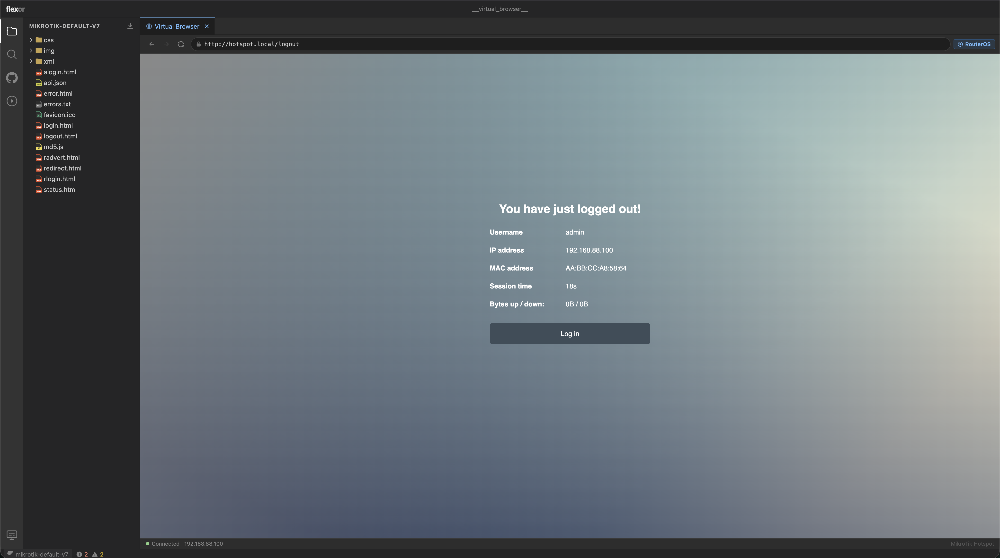

<div align="center">
  
  <h1>Flexor</h1>
  <p>Captive portal emulator & web editor — develop and preview hotspot login pages without a physical router.</p>
  <p>
    <a href="https://github.com/gilang-as/flexor"></a>
    
    
    
    
    <a href="LICENSE"></a>
  </p>
</div>

---

## Screenshots

| Welcome | Editor |
|---------|--------|
|  |  |

| Virtual Browser | Simulator Config |
|-----------------|------------------|
|  |  |

---

## What is Flexor?

Flexor is a browser-based tool (and local CLI) for editing, simulating, and previewing **captive portal** templates — the login pages shown by Wi-Fi hotspot routers.

Instead of uploading files to a real router every time you change a line of HTML, Flexor runs the entire portal engine as a **WebAssembly module** in your browser. Edit, save, and instantly see how the login page looks — no router needed.

**Currently supported providers**
- ✅ MikroTik RouterOS (v6 & v7 templates)

**Planned providers** *(contributions welcome!)*
- ⬜ pfSense / OPNsense captive portal
- ⬜ OpenWrt (nodogsplash, coova-chilli)
- ⬜ Cisco / Meraki
- ⬜ Any provider with a well-documented template spec

---

## Features

| Feature | Description |
|---------|-------------|
| **Web Editor** | VS Code-like editor (Monaco) with syntax highlighting, file tree, tabs |
| **Virtual Browser** | Simulated browser that intercepts requests and renders the portal HTML |
| **WASM Engine** | Go portal engine compiled to WebAssembly — runs 100% client-side |
| **CLI Server** | Local HTTP server for testing with a real browser |
| **GitHub Integration** | Open repos, commit & push, branch switching — with or without a token |
| **Search & Replace** | Full-text search with regex, case-sensitive, whole-word, file include/exclude |
| **Download as ZIP** | Export the entire template folder as a ZIP archive |
| **Multi-template** | Bring any MikroTik hotspot template folder; community examples available |

---

## Project Structure

```
flexor/
├── engine/                   # Go module (gopkg.gilang.dev/flexor)
│   ├── mikrotik.go           # Session, SessionStore, ServerConfig, Variables()
│   ├── template.go           # Template engine: $(var), $(if/elif/else/endif)
│   ├── portal.go             # HTTP-agnostic portal engine
│   ├── simulator.go          # net/http wrapper
│   ├── embed.go              # embed.FS — bundle templates into binary/WASM
│   └── cmd/
│       ├── cli/main.go       # CLI server
│       └── wasm/main.go      # WebAssembly entry point → JS API
│
├── editor/                   # React 19 + Vite + Monaco web editor
│   ├── src/
│   │   ├── App.tsx           # Root component + all state
│   │   ├── components/
│   │   │   ├── EditorArea.tsx       # Monaco editor + tabs
│   │   │   ├── ExplorerPanel.tsx    # File tree (local + GitHub)
│   │   │   ├── SearchPanel.tsx      # VS Code-like search & replace
│   │   │   ├── ActivityBar.tsx      # Left icon strip
│   │   │   ├── GitHubPanel.tsx      # GitHub connect / repo browser
│   │   │   ├── SimulatorPanel.tsx   # Hotspot config panel
│   │   │   └── VirtualBrowser.tsx   # Virtual browser tab
│   │   └── utils/
│   │       ├── fs.ts                # File System Access API helpers
│   │       └── github.ts            # GitHub REST API client
│   └── public/
│       └── portal.wasm              # Built WASM (not committed)

```

---

## Quick Start

### Prerequisites

- Go 1.21+
- Node.js 18+
- Chrome or Edge (File System Access API)

---

### Option A — Web Editor (browser)

**1. Build the WASM module**

```bash
cd engine
GOOS=js GOARCH=wasm go build -o ../editor/public/portal.wasm ./cmd/wasm/
```

**2. Run the editor dev server**

```bash
cd editor
npm install
npm run dev
# → http://localhost:5173
```

Then open the editor, click **Open Folder** or **Import from GitHub**, and start editing. The Virtual Browser tab lets you simulate the login flow in real time.

---

### Option B — CLI Server (local HTTP)

```bash
cd engine
go run ./cmd/cli/main.go
# → http://127.0.0.1:8080
```

Open your real browser to that address and you'll see the captive portal login page.

**Available flags:**

```
-bind string          Listen address               (default ":8080")
-hostname string      Hostname in portal links     (default "127.0.0.1:8080")
-identity string      RouterOS identity name       (default "MikroTik")
-server-name string   HotSpot server name          (default "hotspot1")
-templates string     Path to hotspot template directory (required)
-trial                Allow trial access (T-<mac>)
-users string         user:password pairs          (default "admin:admin,user:password")
```

```bash
# Example
go run ./cmd/cli/main.go \
  -users "gilang:secret,tamu:tamu" \
  -templates /path/to/your/template
```

---

### Option C — Use as a Go Library

```bash
go get gopkg.gilang.dev/flexor
```

```go
import flexor "gopkg.gilang.dev/flexor"

cfg := flexor.DefaultConfig()
portal := flexor.NewPortalWithFS(cfg, flexor.DefaultTemplates)
portal.AddUser("admin", "secret")

resp := portal.CheckAccess(clientIP, cookie, "https://google.com")
if resp.Action == "portal" {
    // Render resp.HTML to the client
}
```

---

## Template Syntax (MikroTik)

```html
<!-- Variable substitution -->
Hello, $(username)!  Your IP: $(ip)
<a href="$(link-logout)">Logout</a>

<!-- Conditionals -->
$(if logged-in == yes)
  <p>Welcome back, $(username). Uptime: $(uptime)</p>
$(elif trial == yes)
  <p>Trial access active.</p>
$(else)
  <p>Please log in.</p>
$(endif)
```

All available variables are documented in [MIKROTIK.md](MIKROTIK.md).

---

## Template Examples

The `templates/` directory is not bundled in this repo — grab a ready-made template from one of these community repos:

| Template | Description |
|----------|-------------|
| [router-os-default-hotspot-new](https://github.com/gilang-as/router-os-default-hotspot-new) | MikroTik RouterOS default hotspot (new version) |
| [router-os-default-hotspot](https://github.com/gilang-as/router-os-default-hotspot) | MikroTik RouterOS default hotspot (classic) |
| [mikrotik-hotspot-template-pink](https://github.com/gilang-as/mikrotik-hotspot-template-pink) | Custom pink-themed MikroTik hotspot template |

**Usage with CLI:**
```bash
# Clone a template then point the CLI at it
git clone https://github.com/gilang-as/router-os-default-hotspot-new my-template
cd engine
go run ./cmd/cli/main.go -templates ../my-template
```

**Usage with Web Editor:**
Click **Open Folder** and select the cloned template directory.

---

## Roadmap

### Near-term
- [ ] LSP server for MikroTik template variables (autocomplete & hover docs in the web editor)
- [ ] VS Code extension with the same LSP
- [ ] Improve simulator: session timers, bandwidth tracking, advertisement flow

### Provider support
- [ ] pfSense / OPNsense captive portal
- [ ] OpenWrt (nodogsplash)
- [ ] Generic HTML-only portal (no special syntax)

### Infrastructure
- [ ] Published WASM build (no local build required)
- [ ] One-click deploy to Vercel / Cloudflare Pages

---

## Contributing

Contributions are very welcome! Here are the best areas to help:

### Add a new provider
1. Create a template folder (can be a standalone repo) with the provider's HTML pages
2. Add a new `ProviderXxx` constant and implement the variable map in `engine/`
3. Wire it up in the CLI and WASM API

### Improve the editor
- Bug fixes, UI polish, performance
- Keyboard shortcuts, drag-and-drop, multi-cursor save

### Write tests
- Unit tests for the Go template engine (`engine/template_test.go`)
- Integration tests for the portal flow

### How to submit
1. Fork the repo
2. Create a branch: `git checkout -b feat/my-feature`
3. Commit your changes and open a Pull Request
4. Please include a short description of what changed and why

> For large changes, open an issue first to discuss the approach.

---

## License

GPL-2.0 — see [LICENSE](LICENSE).

---

<div align="center">
  Made with ♥ by <a href="https://github.com/gilang-as">Gilang Adi S</a>
</div>

